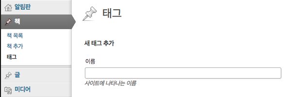
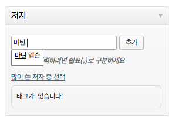

## 관리자 페이지 코딩하기 - custom taxonomy로 저자와 번역자 추가하기

### 기획

일단 책에 들어가는 정보는 아래와 같다.

* 제목
* 저자
* 저자 소개
* 번역자
* 가격
* 출간일
* 페이지수
* 책 소개
* 목차
* 출력 순서
* 새로 나온 책 여부
* 추천 책 여부
* 주제 분류
* 함께 읽을 책
* 표지 이미지

하드코딩을 하면 쉽겠지만, 워드프레스에서 이 정보들을 모두 입력할 수 있도록 만드는 건 일단 답답하게 느껴진다. 해 본 적이 없고, 무엇보다 이미 있는 틀 안에 끼워 넣어야 하는 거니까 그렇게 느껴 지는 것이다. 아마도 다들 그럴 텐데, 자신이 처음부터 작성하는 코드가 남이 짠 코드를 수정하는 것보다 마음이 편하다. 워드프레스가 아무리 훌륭한 CMS라고 해도 어쨌든 남이 만든 코드에 내 코드를 끼워 넣는 것이니, 아주아주 익숙해지기 전까지는 약간의 불편함을 갖고 작업해야 하는 것 같다.

워드프레스로 이런 정보들을 넣을 때 분명한 장점도 있다. 목록 페이지를 따로 만들지 않아도 된다. 페이징 처리도 따로 할 필요 없다. 기본적인 검색도 기본으로 제공된다. DB 테이블을 설계할 필요도 없다. 개발자는 오로지 입력/수정 화면 구성과 DB 입출력 부분만 신경을 쓰면 그만이다. 이게 CMS의 장점이다.

이제 위에서 나열한 각 정보를 어떻게 처리할지 생각해 보자.

* 출력 순서, 가격, 출간일, 페이지수, 책 소개, 목차, 함께 읽을 책 : 이것들은 별다른 고민 없이 custom field로 처리할 수 있는 놈들이다.
* 저자, 번역자, 추천 책 여부, 주제 분류 : custom taxonomy로 처리하는 게 제격이다.
* 새로 나온 책 여부 : 새로 나온 책의 경우 수동으로 조정하게 될 여지가 많다. 엄청나게 커서 눈코뜰 새 없이 새 책이 쏟아져 나오는 출판사의 경우 특정 기간을 정해 자동으로 처리하는 게 나을 수도 있다. 하지만 작은 출판사의 경우에는 새로 나온 책의 목록에 포함해 두는 게 들쭉날쭉일 수 있다. 어떤 때는 신간이 한 권만 나온 채 반 년이 흐를 수도 있고, 어떤 때는 신간이 한꺼번에 3~4권씩 나올 수도 있기 때문이다. 그래서 굳이 '새로 나온 책 여부'라는 항목이 필요하고, 이건 그러면 custom taxonomy로 처리하면 되겠다.
* 저자 소개 : 저자를 custom taxonomy로 처리하니, 저자 소개는 custom taxonomy의 설명으로 넣어야 하나 하는 고민이 들 수 있겠다. (카테고리나 태그 메뉴에 가 보면 '설명'이라는 입력 항목을 볼 수 있다.) 그러나 같은 저자라 해도 모든 책에서 소개가 같은 게 아니다. 따라서 저자의 소개는 저자에 종속적인 게 아니라 책에 종속적이다. 그러므로 저자 소개는 저자의 설명 항목으로 처리하지 않고, 책의 custom field로 처리한다. 

#### custom taxonomy를 사용할 때 장점

위 항목중, '새로 나온 책 여부'와 '추천 책 여부'는 custom field로 처리해도 무방하다. 내가 custom taxonomy로 처리한 이유는 클라이언트 단에서 처리하기 더 편하기 때문이다. custom taxonomy로 처리하면 `http://domain.com/?new_book=y`라는 도메인 접근만으로 새로 나온 책의 목록을 볼 수 있다. 그러나 custom field로 처리하면 페이지를 만들고 따로 코딩을 해 줘야 한다. 저자나 번역자, 주제 분류에서도 custom taxonomy로 간단하게 목록을 가져올 수 있다. 

또한 관리자 페이지에서도 유리한 점이 있다. custom taxonomy는 입력/수정 화면에 선택 박스가 자동으로 나타난다. custom field로 하면 따로 코딩을 해 줘야 하는데 말이다. custom taxonomy는 목록에 표시해 주기도 수월하다. 여튼 여러 모로 장점이 있으니 custom taxonomy로 처리할 수 있다면 그렇게 하는 게 낫다.

이 목록을 표시하는 데 사용하는 테마의 파일과 우선순위는 아래와 같다. ([[워드프레스] 테마에서 템플릿 파일 매칭 순서](http://mytory.net/archives/10119) 참고)

    taxonomy-[tax]-[term].php → taxonomy-[tax].php → taxonomy.php → archive.php → index.php

`tax`는 taxonomy의 slug를 말하는 것이고, `term`은 taxonomy의 구체적 내용의 slug를 말하는 것이다. 예컨대, `author`라는 taxonomy가 있고, 이 아래 알렉스 캘리니코스라는 author가 있다고 하자. 이 author의 slug는 `alex-callinicos`다. 알렉스만을 위한 페이지를 만들려면 `taxonomy-author-alex-callinicos.php`라는 파일을 만들면 된다. 물론 그럴 일은 많지 않을 것이다. 보통은 `taxonomy-author.php`만 만들면 될 것이다. 그러나 사실 그것까지도 필요 없다. 출판사 사이트의 경우 책 목록 페이지의 구성은 모두 같으므로 그냥 `archive.php`를 잘 만들면 된다.

### custom taxonomy를 등록해 보자

기획을 했으니 실행을 해 보자. custom taxonomy를 등록하는 건 [Codex의 register_taxonomy 함수 레퍼런스](http://codex.wordpress.org/Function_Reference/register_taxonomy)를 참고하면 된다. 기본 사용법은 아래와 같다.

    register_taxonomy( $taxonomy, $object_type, $args );

* `$taxonomy` : 이 분류의 slug다.
* `$object_type` : 이 분류를 적용할 `post_type`이다. 문자열로 넣으면 되는데 여러 개인 경우 배열로 넣으면 된다.
* `$args` : 안 써도 되는 선택값이고, 설정 옵션이다. 앞서 `register_post_type`을 경험해 봐서 알겠지만 생략할 수 있다고 해서 생략해도 되는 건 아니다.

앞서 `register_post_type` 때 본 것처럼, 역시나 `init` 액션이 일어날 때 이 함수가 실행되도록 해야 하고 따라서 `add_action` 함수를 사용해서 `register_taxonomy`를 실행하는 함수를 등록해 줘야 한다. 하나씩 해 보자. 일단 `functions-custom-taxonomy.php`라고 파일을 만들고 작업하자. 파일을 만들었으면 `functions.php` 파일의 맨 밑에다가 `include`해 주자.

    include 'functions-custom-taxonomy.php';

### 저자와 번역자를 만들어 보자

이제 준비가 됐으니 `functions-custom-taxonomy.php`에 코드를 작성해 넣자. 일단 코드의 기본형은 아래와 같을 것이다.

    function mpub_custom_taxonomy(){
      register_taxonomy('author', 'book');
    }
    add_action('init', 'mpub_custom_taxonomy');

이렇게만 하면 어떤 결과가 나올까? (commit checksum `4a5c2e`)

이렇게 그냥 태그로만 등장하게 된다. 저자와 번역자는 어차피 태그와 기능이 똑같다. 그러니 `label`만 설정을 해 주면 된다. 아래처럼 `$args`를 설정하고 넣어 주자. (commit checksum `708502`)

    function mpub_custom_taxonomy(){
      $args = array('label'=>'저자');
      register_taxonomy('author', 'book', $args);
    }
    add_action('init', 'mpub_custom_taxonomy');

그러면 이제 메뉴 항목이 저자라고 표시된다. `labels`로 하지 않고 간단히 `label`로만 처리해도 되지 않을까 했는데 역시 안 되겠다. 메뉴는 저자로 나오는데 버튼에는 '새 태그 추가'라고 나온다. 에라 그냥 `labels`로 넣어 줘야겠다. 아래처럼 코드를 변경해 보자.

    function mpub_custom_taxonomy(){

      $labels_author = array(
        'name' => '저자',
        'singular_name' => '저자',
        'search_items' => '저자 검색',
        'popular_items' => '많이 쓴 저자',
        'all_items' => '저자 목록',
        'edit_item' => '저자 수정',
        'view_item' => '저자 보기',
        'update_item' => '저장',
        'add_new_item' => '저자 추가',
        'new_item_name' => '새 저자 이름',
        'separate_items_with_commas' => '여러 명 입력하려면 쉽표(,)로 구분하세요',
        'add_or_remove_items' => '저자 추가 혹은 삭제',
        'choose_from_most_used' => '많이 쓴 저자 중 선택',
        'not_found' => '저자가 없습니다',
        'menu_name' => '저자',
      );

      $args = array('labels'=>$labels_author);
      
      register_taxonomy('author', 'book', $args);
    }
    add_action('init', 'mpub_custom_taxonomy');

`$args` 배열에서 `label`을 `labels`로 변경한 뒤 `$labels_author` 배열을 넣어 줬다. 나머지는 같다. (commit checksum 2f6f68)

### 계층형이 아닌 tag형 taxonomy의 `labels`

우리가 만든 author라는 taxonomy는 tag와 유사한 형태의 taxonomy다. 코딩과 관련지어 말하면 `$args`의 `hierarchical`(계층형) 항목을 `false`로 한 taxonomy다. `hierarchical`을 어떻게 하냐에 따라 `labels`에 들어갈 항목이 달라진다. 물론 안 넣어도 될 걸 넣거나, 넣어야 할 걸 넣지 않는다고 에러가 나진 않지만 코드를 깔끔하게 하고 괜한 혼란을 줄이는 데는 도움이 될 거다.

`labels`에 들어갈 항목과 들어가지 않을 항목은 어떻게 알 수 있을까? 워드프레스는 오픈소스다. 코드를 뜯어 보자. 그럼 알 수 있다. 우선 `register_taxonomy` 함수를 뜯어 보자. 이 함수는 `wp-includes/taxonomy.php`의 314번째 줄에 위치해 있다. 코드를 뜯어 보다 보면 384번째 줄에서 아래와 같은 코드를 만날 수 있다.

    $args['labels'] = get_taxonomy_labels( (object) $args );

`get_taxonomy_labels` 함수가 아마 `labels`를 파싱하는 함수인 것 같다. 해당 함수를 따라가 보자. 해당 함수는 역시 `taxonomy.php`의 422번째 줄에 위치해 있다. 그리고 아래와 같은 이름표 기본값 코드를 갖고 있다. 이제 실마리를 찾았다.

    $nohier_vs_hier_defaults = array(
      'name' => array( _x( 'Tags', 'taxonomy general name' ), _x( 'Categories', 'taxonomy general name' ) ),
      'singular_name' => array( _x( 'Tag', 'taxonomy singular name' ), _x( 'Category', 'taxonomy singular name' ) ),
      'search_items' => array( __( 'Search Tags' ), __( 'Search Categories' ) ),
      'popular_items' => array( __( 'Popular Tags' ), null ),
      'all_items' => array( __( 'All Tags' ), __( 'All Categories' ) ),
      'parent_item' => array( null, __( 'Parent Category' ) ),
      'parent_item_colon' => array( null, __( 'Parent Category:' ) ),
      'edit_item' => array( __( 'Edit Tag' ), __( 'Edit Category' ) ),
      'view_item' => array( __( 'View Tag' ), __( 'View Category' ) ),
      'update_item' => array( __( 'Update Tag' ), __( 'Update Category' ) ),
      'add_new_item' => array( __( 'Add New Tag' ), __( 'Add New Category' ) ),
      'new_item_name' => array( __( 'New Tag Name' ), __( 'New Category Name' ) ),
      'separate_items_with_commas' => array( __( 'Separate tags with commas' ), null ),
      'add_or_remove_items' => array( __( 'Add or remove tags' ), null ),
      'choose_from_most_used' => array( __( 'Choose from the most used tags' ), null ),
    );

`parent_item` 부분을 보자. `parent_item`은 계층형인 경우에만 필요한 이름표다. `parent_item`의 값에는 `array( null, __( 'Parent Category' ) )`라고 들어 있다. 앞부분 값이 `null`이고 뒷부분 값엔 적당한 이름표가 들어가 있다. `search_items` 항목을 보자. 값을 보면 `array( __( 'Search Tags' ), __( 'Search Categories' ) ),`라고 들어가 있다. 앞부분은 태그라고, 뒷부분은 카테고리라고 돼 있다. 이제 분명해 졌다. 앞부분에 `null`이라고 들어간 항목은 계층형(카테고리형)에만 필요한 항목이고, 뒷부분에 `null`이라고 들어간 항목은 비계층형(태그형)에만 필요한 항목이다.

그래서 정리해 보면, `parent_item`과 `parent_item_colon`은 계층형 taxonomy에만 필요한 이름표고 `popular_items`와 `separate_items_with_commas`, `add_or_remove_items`, `choose_from_most_used`는 비계층형 taxonomy에만 필요한 이름표라는 걸 알 수 있다. 

위 `$nohier_vs_hier_defaults`엔 없지만 필요한 것도 있다. `not_found`와 `menu_name`이 그렇다. `$nohier_vs_hier_defaults`에는 없지만 내가 짠 `mpub_custom_taxonomy` 코드의 `labels`에는 들어 있다. 어디선가 중간에 끼워 넣는 코드가 있겠지만, 더 찾아 보지는 않기로 한다. 이정도 봤으면 충분해 보인다.

### 결과를 보자

코딩을 했으니 결과를 볼 시간이다. 이름표가 깔끔하게 들어간 것은 직접 확인해 보면 될 것이고. 한번 '책 추가' 메뉴로 들어가 보자. 아래와 같은 메타 박스를 발견할 수 있을 거다.

이렇게 custom taxonomy를 추가하면 자동으로 편집 항목에 나타난다. 태그형이므로 선택을 하는 게 아니라 사용자가 입력을 하게 돼 있는데, 이미 있는 항목의 경우엔 일부를 입력하면 자동완성 항목으로 나타난다. 이게 CMS를 이용하면 편리한 점이다. 자잘한 반복에서 벗어나 비즈니스 로직에만 집중할 수 있게 해 주는 것이다.

### 번역자를 추가해 보자

저자와 똑같이 하면 된다. 간단하니 코드만 제시하겠다. 신경쓸 점은 코드를 `mpub_custom_taxonomy` 안에 넣으면 된다는 거다. 한 번 `add_action`으로 등록을 했으니 다시 등록할 필요 없이 custom taxonomy를 추가로 등록할 때는 `mpub_custom_taxonomy` 함수 안에서 다 처리하면 되는 거다. 그래서 완성된 코드는 아래와 같다. 저자 코드 부분은 생략했다. (commit checksum `3b0820e`)

    function mpub_custom_taxonomy(){

      // 저자 관련 코드는 생략...

      $labels_translator = array(
        'name' => '번역자',
        'singular_name' => '번역자',
        'search_items' => '번역자 검색',
        'popular_items' => '많이 쓴 번역자',
        'all_items' => '번역자 목록',
        'parent_item' => null,
        'parent_item_colon' => null,
        'edit_item' => '번역자 수정', 
        'view_item' => '번역자 보기',
        'update_item' => '저장',
        'add_new_item' => '번역자 추가',
        'new_item_name' => '새 번역자 이름',
        'separate_items_with_commas' => '여러 명 입력하려면 쉽표(,)로 구분하세요',
        'add_or_remove_items' => '번역자 추가 혹은 삭제',
        'choose_from_most_used' => '많이 쓴 번역자 중 선택',
        'not_found' => '번역자가 없습니다',
        'menu_name' => '번역자',
      );

      $args = array('labels'=>$labels_translator);

      register_taxonomy('translator', 'book', $args);
    }
    add_action('init', 'mpub_custom_taxonomy');