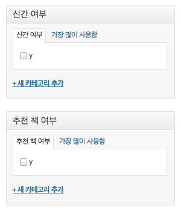
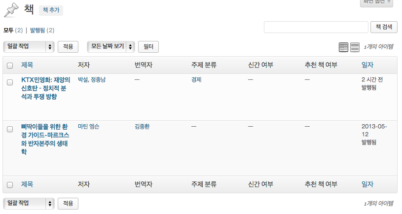

## 관리자 페이지 코딩하기 - keyword 바로 잡기, custom taxonomy로 주제 분류 추가하기

### keyword 충돌 방지

앞서 저자 taxonomy의 slug를 `author`로 정했다. 그런데 `author`는 블로그 글의 필자와 키워드가 겹친다. 예컨대, 블로그 실제 글의 저자 mytory가 쓴 글의 목록을 본다고 가정하자. mytory의 ID는 1이다. 그러면 `http://mydomain.com/?author=1`라는 URL로 접근하면 된다. taxonomy를 위한 URL도 똑같기 때문에 이러면 골치아파진다. 만약 slug가 1인 taxonomy가 존재하게 된다면 author나 taxonomy 둘 중 하나는 URL이 제대로 작동하지 않게 될 것이다. 

물론, taxonomy의 slug가 숫자가 될 확률은 적겠지만, 충돌할 수 있는 여지를 남기지 않는 것이 좋다. 그러니 taxonomy의 slug를 변경하도록 하자. `book-author`가 좋겠다.

그러면 `functions-custom-taxonomy.php`파일에서 아래와 같이 코드를 고치면 되겠다. (commit checksum `1f3afb2`)

    register_taxonomy('book-author', 'book', $args);

간단하다. 그리고, 기존에 author로 데이터를 넣어 둔 게 있다면 아래 sql문을 날려서 수정하자.

    UPDATE `wp_term_taxonomy` SET `taxonomy` = 'book-author' WHERE `taxonomy` = 'author';

데이터베이스 테이블 앞의 접두어는 당연히 자신이 설정한 것으로 해야 한다.

### custom taxonomy로 주제 분류를 추가해 보자

이제 주제 분류를 추가해 보자. 주제 분류는 계층형이어야 하고, 꼭 계층형이 아니라 해도 tag형처럼 자유롭게 사용자 맘대로 추가해선 안 되는 분류다. 그러면 $args를 다음과 같이 하면 되겠다.

    $args = array(
      'labels' => $labels_book_subject,
      'hierarchical' => TRUE,
    );

`hierarchical` 옵션을 TRUE로 추면 계층형 taxonomy가 되고, category처럼 작동한다. category는 tag와 달리 미리 입력해 둔 것들 중에서 선택해야 하며 계층형으로 구성할 수 있는데, `hierarchical`을 `true`로 주면 그렇게 되는 것이다.

이름표는 아래와 같이 구성했다.

    $labels_book_subject = array(
      'name' => '주제 분류',
      'singular_name' => '주제 분류',
      'search_items' => '주제 분류 검색',
      'all_items' => '주제 분류 목록',
      'parent_item' => '부모 주제',
      'parent_item_colon' => '부모 주제:',
      'edit_item' => '주제 분류 수정',
      'view_item' => '주제 분류 보기',
      'update_item' => '저장',
      'add_new_item' => '주제 분류 추가',
      'new_item_name' => '주제 분류명',
      'not_found' => '주제 분류가 없습니다',
      'menu_name' => '주제 분류',
    );

비계층형 전용 이름표는 뺐고, 계층형에 필요한 이름표만 넣었다. 그리고 마지막으로 이 코드로 등록을 해 줬다.

    register_taxonomy('book-subject', 'book', $args);

이러면 주제 분류가 완성. 아래처럼 관리자 메뉴와 책 추가 화면에 등장한다. (commit checksum `d2a12a`)

 

### 새로 나온 책 여부와 추천 책 여부를 만들어 보자

custom taxonomy를 사용해서 만들 마지막 놈은 새로 나온 책 여부와 추천 책 여부다. 이 두 가지를 굳이 custom taxonomy로 만드는 이유는, 일단 taxonomy(분류 쳬계)가 맞으니까 그런 거고, 부수적으로는 목록을 쉽게 뽑기 위해서 그런 것이다.

코드를 반복하지는 않겠다. 두 경우 모두 값(term)은 y와 n밖에 없어야 하고 사용자가 맘대로 입력할 수 없도록 해야 한다. 계층형인 것은 아니지만 그래서 계층형으로 만들어야 한다. 사용자가 실수로 term을 만드는 경우가 없도록 하기 위해서 `hierarchical`을 `true`로 주도록 하자. 꼼꼼히 신경쓸 taxonomy가 아니니까 `labels`로 하지 않고 `label`로 했다. 그래서 `mpub_custom_taxonomy` 함수 안에 아래 코드를 넣으면 완료다. 새로 나온 책 여부라고 하기가 너무 길어서 그냥 일반적으로 쓰는 용어인 '신간'으로 변경해서 이름표를 붙였다. (commit checksum `e7373ad`)

    $args = array(
      'label' => '신간 여부',
      'hierarchical' => TRUE,
    );
    register_taxonomy('new-book', 'book', $args);

    $args = array(
      'label' => '추천 책 여부',
      'hierarchical' => TRUE,
    );
    register_taxonomy('recommend-book', 'book', $args);

그리고 'y'라는 term 하나만 만들면 된다. 어차피 'y'에 들어있지 않으면 'n'이니 말이다. (term은 taxonomy의 값이다. 번역하면 '용어'인데, 여튼 분류의 내용을 말한다. 주제라는 taxonomy 밑에는 경제라는 term이 있는 것이다.)

책 추가에 들어가 보면 아래처럼 나온다.

### 관리자 목록에서 custom taxonomy 나오게 하기

이제 관리자 목록 화면에서 custom taxonomy가 나오도록 해 보자. 워드프레스 3.5 버전부터는 `register_taxonomy`의 `$args`에 옵션을 주는 것으로 목록에 custom taxonomy를 출력하는 게 가능해졌다. 아래처럼 `show_admin_column` 옵션을 `TRUE`로 주면 된다.

    $args = array(
      'labels' => $labels_author,
      'show_admin_column' => TRUE,
    );

자, 지금까지 생성한 모든 custom taxonomy에 `show_admin_column` 옵션을 `TRUE`로 주자. (commit checksum `3096586`)

그러면 아래처럼 나올 거다.

그런데 너비가 엉망이다. 이건 관리자 화면 CSS를 조정해서 해결해야 한다. 쉬우니 빠르게 해 보자!

### 관리자 화면용 CSS 등록하고 적용하기

일단 `admin.css` 파일을 테마 폴더에 만들어 넣자. 그리고 아래처럼 CSS 코드를 써 넣자. CSS 코드까지 굳이 설명하진 않겠다.

    @charset "utf-8";
    .column-taxonomy-book-author,
    .column-taxonomy-translator,
    .column-taxonomy-new-book,
    .column-taxonomy-recommend-book {
        width: 7%;
    }
    .column-taxonomy-book-subject {
        width: 14%;
    }

각 taxonomy가 나오는 `th`와 `td`에는 `column-taxonomy-[slug]` 형식의 클래스가 붙는다. 따라서 그 놈의 너비를 지정해 주면 된다.

CSS를 만들었다면 이제 관리자 화면에서 CSS를 불러올 수 있도록 해야 할 것이다. 이 때 쓰는 게 action의 `admin_enqueue_scripts` 키워드다. 이건 custom post type이나 custom taxonomy가 아니니까 `functions.php` 파일에 넣자. (commit checksum `9ec97e6`)

    /**
     * 관리자 화면용 CSS
     */
    function mpub_admin_scripts_styles(){
      wp_enqueue_style( 'mpub-admin', get_template_directory_uri() . '/admin.css');
    }
    add_action('admin_enqueue_scripts', 'mpub_admin_scripts_styles');

`admin_enqueue_scripts` 키워드엔 js만 걸어야 할 것 같지만 사실 스타일까지 다 건다. 다들 그렇게 하더라. 그리고, 역시 스타일을 발동해 주는 함수를 실행하는 함수를 만든 다음 그걸 명시해 준다. `do_action( 'admin_enqueue_scripts' )`라는 코드가 명시해 준 `mpub_admin_scripts_styles` 함수를 실행하게 될 것이고, 그러면 우리가 등록한 `mpub-admin` 스타일을 큐에 쌓아 줄 것이다. 큐에 쌓인 이 스타일은 HTML을 출력할 때 적당한 위치에서 또 출력될 것이다. 

뭐, 알 사람들은 알겠지만, js를 큐에 쌓아야 할 경우엔 `wp_enqueue_script`를 사용하면 된다. 이렇게 작성하고 책 목록 화면에 들어가 보면 깔끔하게 정리된 것을 볼 수 있다.

