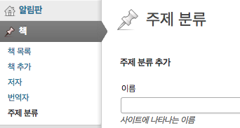
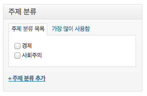

## 관리자 페이지 코딩하기 - keyword 바로 잡기, custom taxonomy로 주제 분류 추가하기

### keyword 충돌 방지

앞서 저자 taxonomy의 slug를 `author`로 정했다. 그런데 `author`는 블로그 글의 필자와 키워드가 겹친다. 예컨대, 블로그 실제 글의 저자 mytory가 쓴 글의 목록을 본다고 가정하자. mytory의 ID는 1이다. 그러면 `http://mydomain.com/?author=1`라는 URL로 접근하면 된다. taxonomy를 위한 URL도 똑같기 때문에 이러면 골치아파진다. 만약 slug가 1인 taxonomy가 존재하게 된다면 author나 taxonomy 둘 중 하나는 URL이 제대로 작동하지 않게 될 것이다. 

물론, taxonomy의 slug가 숫자가 될 확률은 적겠지만, 충돌할 수 있는 여지를 남기지 않는 것이 좋다. 그러니 taxonomy의 slug를 변경하도록 하자. `book-author`가 좋겠다.

그러면 `functions-custom-taxonomy.php`파일에서 아래와 같이 코드를 고치면 되겠다. (commit checksum `1f3afb2`)

    register_taxonomy('book-author', 'book', $args);

간단하다. 그리고, 기존에 author로 데이터를 넣어 둔 게 있다면 아래 sql문을 날려서 수정하자.

    UPDATE `wp_term_taxonomy` SET `taxonomy` = 'book-author' WHERE `taxonomy` = 'author';

데이터베이스 테이블 앞의 접두어는 당연히 자신이 설정한 것으로 해야 한다.

### custom taxonomy로 주제 분류를 추가해 보자

이제 주제 분류를 추가해 보자. 주제 분류는 계층형이어야 하고, 꼭 계층형이 아니라 해도 tag형처럼 자유롭게 사용자 맘대로 추가해선 안 되는 분류다. 그러면 $args를 다음과 같이 하면 되겠다.

    $args = array(
      'labels' => $labels_book_subject,
      'hierarchical' => TRUE,
    );

`hierarchical` 옵션을 TRUE로 추면 계층형 taxonomy가 되고, category처럼 작동한다. category는 tag와 달리 미리 입력해 둔 것들 중에서 선택해야 하며 계층형으로 구성할 수 있는데, `hierarchical`을 `true`로 주면 그렇게 되는 것이다.

이름표는 아래와 같이 구성했다.

    $labels_book_subject = array(
      'name' => '주제 분류',
      'singular_name' => '주제 분류',
      'search_items' => '주제 분류 검색',
      'all_items' => '주제 분류 목록',
      'parent_item' => '부모 주제',
      'parent_item_colon' => '부모 주제:',
      'edit_item' => '주제 분류 수정',
      'view_item' => '주제 분류 보기',
      'update_item' => '저장',
      'add_new_item' => '주제 분류 추가',
      'new_item_name' => '주제 분류명',
      'not_found' => '주제 분류가 없습니다',
      'menu_name' => '주제 분류',
    );

비계층형 전용 이름표는 뺐고, 계층형에 필요한 이름표만 넣었다. 그리고 마지막으로 이 코드로 등록을 해 줬다.

    register_taxonomy('book-subject', 'book', $args);

이러면 주제 분류가 완성. 아래처럼 관리자 메뉴와 책 추가 화면에 등장한다. (commit checksum `d2a12a`)

 
