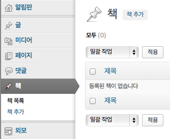

## custom post type - book을 만들어 보자

### 기본 개념

워드프레스에서 내용을 가진 모든 것은 `post`로 불린다. 그리고 이 `post`엔 post type이 있어서 분류가 된다. 워드프레스에서 기본적으로 사용하는 `post_type`엔 다음과 같은 것들이 있다.

* attachment : 첨부 파일
* nav_menu_item : 메뉴 아이템
* page : 페이지
* post : 글
* revision : post와 page의 과거 버전 기록

위 값들은 `wp_posts` 테이블의 `post_type` 컬럼에 들어간다. (물론 테이블의 prefix는 설정에 따라 달라질 수 있다.)

이 모든 것들인 일단 post고, 이것들의 `post_type`에 따라 용도가 정해지는 것이다. post의 `post_type`이 `post`고, page의 `post_type`이 `page`라고 말하는 게 좀 이상하게 들릴 수 있겠지만 말이다. 그럼 우리는 book이라는 `post_type`을 만들어서 책을 입력하면 되겠다.

### 등록하기

기본적인 내용은 [Codex의 register_post_type 함수 레퍼런스](http://codex.wordpress.org/Function_Reference/register_post_type)를 참고하면 된다.

다운받은 예제 파일을 보면 `functions-custom-post-type.php`라고 있을 것이다. 이 파일은 `functions.php`에 `include`돼 있다.

여기에 아래 코드를 넣어 보자. 코드는 차분히 설명할 테니 일단 따라해 보자.

  //===== book custom post type =====

  function mpub_custom_init() {
    $labels = array(
      'name' => '책',
      'singular_name' => '책',
      'add_new' => '책 추가',
      'add_new_item' => '책을 추가',
      'edit_item' => '책 수정',
      'new_item' => '새로운 책',
      'all_items' => '책 목록',
      'view_item' => '책 상세 보기',
      'search_items' => '책 검색',
      'not_found' =>  '등록된 책이 없습니다',
      'not_found_in_trash' => '휴지통에 책이 없습니다',
      'parent_item_colon' => '',
      'menu_name' => '책'
    );

    $args = array(
      'labels' => $labels,
      'public' => true,
      'publicly_queryable' => true,
      'show_ui' => true,
      'show_in_menu' => true,
      'query_var' => true,
      'rewrite' => array( 'slug' => 'book' ),
      'capability_type' => 'post',
      'has_archive' => true,
      'hierarchical' => false,
      'menu_position' => null,
      'supports' => array( 'title', 'editor', 'author', 'thumbnail', 'excerpt', 'comments' )
    );

    register_post_type( 'book', $args );
  }
  add_action( 'init', 'mpub_custom_init' );

이렇게 하고 관리자 페이지에 들어가 보면, '책'이라는 메뉴가 생긴 것을 알 수 있다.

