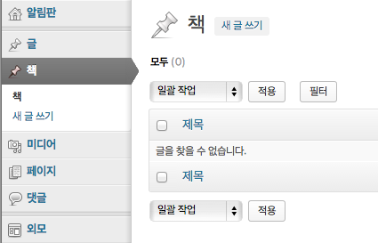

## custom post type - book을 만들어 보자

### 기본 개념

워드프레스에서 내용을 가진 모든 것은 `post`로 불린다. 그리고 이 `post`엔 post type이 있어서 분류가 된다. 워드프레스에서 기본적으로 사용하는 `post_type`엔 다음과 같은 것들이 있다.

* attachment : 첨부 파일
* nav_menu_item : 메뉴 아이템
* page : 페이지
* post : 글
* revision : post와 page의 과거 버전 기록

위 값들은 `wp_posts` 테이블의 `post_type` 컬럼에 들어간다. (물론 테이블의 prefix는 설정에 따라 달라질 수 있다.)

이 모든 것들인 일단 post고, 이것들의 `post_type`에 따라 용도가 정해지는 것이다. post의 `post_type`이 `post`고, page의 `post_type`이 `page`라고 말하는 게 좀 이상하게 들릴 수 있겠지만 말이다. 그럼 우리는 book이라는 `post_type`을 만들어서 책을 입력하면 되겠다.

### 등록하기

기본적인 내용은 [Codex의 register_post_type 함수 레퍼런스](http://codex.wordpress.org/Function_Reference/register_post_type)를 참고하면 된다.

다운받은 예제 파일을 보면 `functions-custom-post-type.php`라고 있을 것이다. 이 파일은 `functions.php`에 `include`돼 있다.

여기에 아래 코드를 넣어 보자. 코드는 차분히 설명할 테니 일단 따라해 보자.

    //===== book custom post type =====

    function mpub_custom_post_type() {
      $args = array(
        'label' => "책",
        'public' => true,
        'has_archive' => true,
      );

      register_post_type( 'book', $args );
    }
    add_action( 'init', 'mpub_custom_post_type' );

이렇게 하고 관리자 페이지에 들어가 보면, '책'이라는 메뉴가 생긴 것을 알 수 있다.

### `add_action`

일단 직접적으로 등록을 하는 부분은 바로 아래 코드다.

    add_action( 'init', 'mpub_custom_post_type' );

워드프레스를 초기화하는 단계(`init`)에 `mpub_custom_post_type`을 실행하라고 등록해 주는 것이다. 워드프레스는 엄청나게 많은 사이트에서 사용하는 플랫폼이다. 워드프레스의 기본적인 실행 코드(코어 파일)를 변경하지 않으면서도 중간중간에 개발자가 자신의 함수를 끼워넣을 수 있도록 해야 한다. 그걸 하도록 해 주는 게 바로 `add_action`과 `add_filter` 함수다. 

워드프레스 코어 파일을 살펴 보면 곳곳에 `do_action( 'keywod' )`와 `apply_filter( 'keyword' )`라는 코드를 볼 수 있다. 개발자가 `add_action`과 `add_filter`로 등록한 함수를 바로 그 지점에서 실행하는 것이다.

루트 폴더의 `wp-setting.php` 파일의 299~306번째 줄을 살펴 보면 아래와 같은 코드가 있다. 우리가 등록한 `mpub_custom_post_type` 함수가 바로 여기에서 실행되는 것이다. `wp-setting.php` 파일은 굉장히 초반에 실행되는 파일이다. 우리의 `mpub_custom_post_type` 함수도 굉장히 초반에 실행될 거라는 걸 알 수 있다.

    /**
     * Most of WP is loaded at this stage, and the user is authenticated. WP continues
     * to load on the init hook that follows (e.g. widgets), and many plugins instantiate
     * themselves on it for all sorts of reasons (e.g. they need a user, a taxonomy, etc.).
     *
     * If you wish to plug an action once WP is loaded, use the wp_loaded hook below.
     */
    do_action( 'init' );

### `register_post_type()`

`register_post_type` 함수는 말 그대로 `post_type`을 등록하는 함수다. `post_type`의 slug와 설정 배열(`$args`)을 인자값으로 받는다.

    register_post_type( 'book', $args );

`register_post_type` 함수는 `wp-includes/post.php`에 정의돼 있는데 아래처럼 생겼다.

    function register_post_type( $post_type, $args = array() ) {
      ...
    }

보면 알겠지만 `$args`는 심지어 빈 배열이 기본값으로 세팅돼 있다. 즉, 설정값은 옵션이다. 그래서 그냥, `register_post_type('book')`이라고만 써도 작동한다는 이야기다. 물론, 기본 설정값과 다른 설정값을 줘야 하므로 우리가 사용해야 하는 book의 경우엔 설정값을 따로 줘야만 한다.

자, 지금까지 알게 된 것은, 워드프레스 구동 초기에 `register_post_type`을 실행하도록 `add_action` 함수로 등록을 했다는 것이다. 다음으로 넘어가 보자.

### `register_post_type`의 `$args`

`register_post_type`의 두 번째 인자값 `$args`는 아래처럼 생겼다.

    $args = array(
      'label' => "책",
      'public' => true,
      'has_archive' => true,
    );

따로 해 줘야 하는 설정은 세 가지다. 

* `label` : 이 post type의 읽기용 이름이 무엇인지 정해 주는 것이다. 우리는 slug는 `book`으로 정했다. `label`을 설정하지 않으면 `label`은 자동으로 book이 된다. 우리가 영어권에 산다면 심지어 이 `label`조차 생략할 수 있을 것이다. 하지만 영어권이 아니니까 이걸 생략할 수는 없겠다. 그래서 이름을 적어 준다. "책"이라고 말이다.
* `public` : 기본값은 `false`다. 그래서 `true`로 변경해 줘야 한다. 이게 `false`면 관리자 화면에 "책"이 등장하지도 않고, 클라이언트 단에서 표시되지도 않는다. 아마 기본적으로 `register_post_type`은 `revision` 같은 걸 등록하기 위해 사용하는 건가 보다. 그렇지 않고서는 기본값이 `false`일 수가 없으니 말이다. 여튼간에 우린 book을 관리자가 관리할 수 있도록 만들 생각이니, 이 옵션을 true로 해 줘야 한다.
* `has_archive` : 기본값은 `false`다. 그래서 `true`로 변경해 줘야 한다. custom post type을 등록하고 이걸 `true`로 설정하면 `http://mydomain.com/?post_type=book`으로 접속해서 목록을 볼 수 있다. 그런데 이 옵션이 `false`면 목록이 나오지 않는다. 우린 책 목록을 볼 수 있도록 해야 하니 이 옵션을 `true`로 한다.

다른 많은 옵션들은 `public` 옵션에 종속적이다. 예컨대, `publicly_queryable`이라는 옵션은 `http://mydomain.com/?post_type=book` 이 URL을 작동하게 할 것인지 작동하지 않게 할 것인지 정하는 옵션이다. Codex 사이트의 함수 레퍼런스를 보면 아래처럼 씌어 있다.

> Default: value of public argument
> 기본값 : public 인자의 값

`register_post_type`의 코드를 살펴 보면 아래처럼 코드가 씌어 있다.

    if ( null === $args->publicly_queryable )
      $args->publicly_queryable = $args->public;

`$args->publicly_queryable`이 `null`이면 `$args->public`의 값을 집어 넣으라는 것이다.

따라서 옵션이 되게 많은데, 대부분의 다른 옵션은 신경쓸 필요가 없다. 여튼간에, 나머지도 하나하나 보는 건 그리 나쁘지 않을 것이니 시간이 된다면 함수 레퍼런스 페이지의 인자값 설명을 해석해 보기 바란다.

